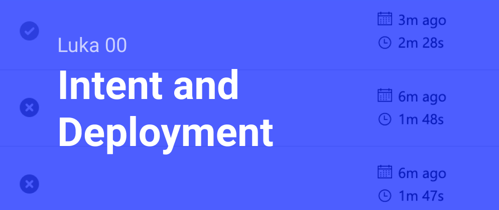
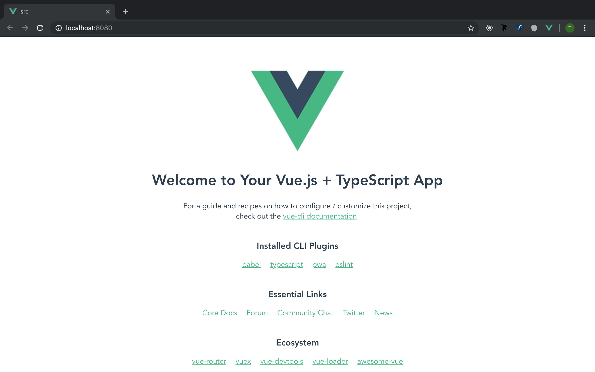
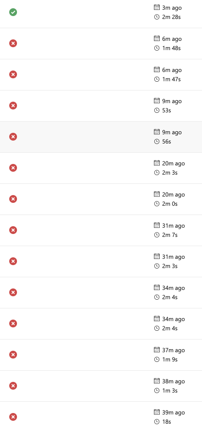
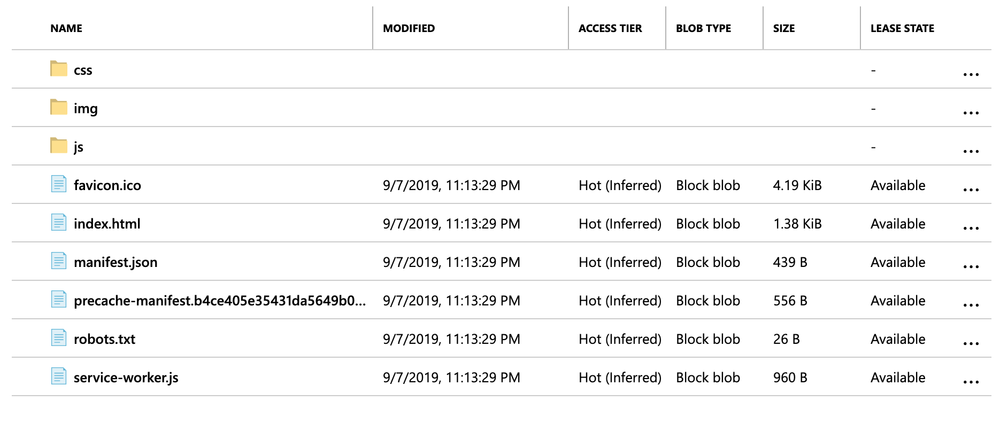
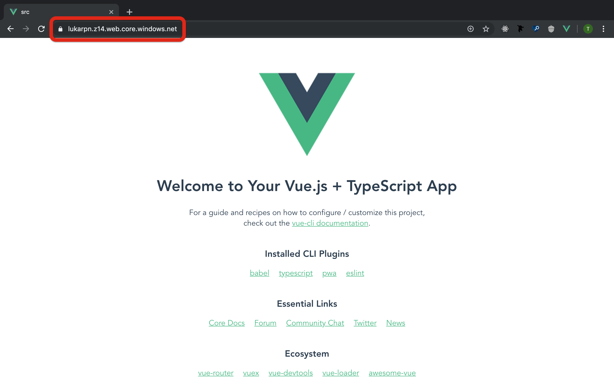

# Luka 00 - Intent and Deployment



> This post is part of a series on the development of a reverse polish notation calculator web-app using Rust/Wasm, Vue, and TypeScript.

Date: 7 September 2019

I have been thinking about this project for a few weeks - ever since I was on the train back from RustConf. I did a tutorial on WASM and Rust. [This One](https://rustwasm.github.io/docs/book/game-of-life/introduction.html). I was inspired to dig more into using WASM (wasm? WAsm?).

When I was learning React, I made a reverse polish notation calculator (RPN). You can see that project [here](http://rpn.herokuapp.com/). It's ok. This project is a new attempt at that project, but seeking to improve the following:  

- Greater mathematical precision: in the original, `(sqrt(2))^2 == 2.0000000000000004`, this is not true. I think that I can use the greater precision of Rust to get better mathematical precision. (I think...) The intent here is to use Rust to generate WASM that does the calculation and passes the result back to the JavaScript to render in Vue. The WASM code will generate functions that I can call from JavaScript.  
- Grown-up CSS: There's nothing wrong with Bootstrap. The original project used Bootstrap. Since working on that project I have learned CSS Grid and how to really style webpages. I want to do that for the purpose of practice, creating a more unique design, and shrinking the footprint of the site.  
- Learning!: I want to learn more about Rust, Vue, TypeScript, CSS, and WASM. That is the main driver.

As for these logs, the goal is to show how projects like this progress. It's not linear and I will make mistakes. I hope I can help others learn by making interesting mistakes. 

I want to start off by just having an endpoint for deployment. I'm going with Azure to be on brand. I know how to deploy a Vue app to Azure -- it's a static website. I don't know if that changes with the added WASM. That is one of the questions this project will answer.  

Before deployment, I will need at least something to deploy. Let's make a Vue app!

## Making a Vue App

I want to keep all the code together nicely, but that always shifts around in the early stages of a project. I am debating having a directory called `src` at the root or calling it `luka`. I'm not sure which is clearer. Is the project the whole of the repository, including the log, etc, or is it just what is in the directory.  

For now, I'll just call it `src`.  

In the newly created `src` directory, run `vue create .` (I'll admit I had to Google it). I created this project with Babel, TS, PWA, CSS Pre-processors, and the Linter.  

I have found TypeScript to save me so many times. I really enjoy using Vue and TS together.  

PWA support is great if people ever one day want to put this on their phones. Who knows.  

I am going to try and use class style syntax for this project. As for a CSS pre-processor, I'm using SCSS. If you are unfamiliar with SCSS, it compiles into CSS, but allows for a larger feature-set and can reduce the amount of styling you have to write manually. [Here](https://dzone.com/articles/introduction-of-scss) is a pretty good intro to SCSS.  

Once the app is generated, I can open it up in a browser with `npm run serve`.  

Great!



Now that I look at it. I feel silly that there is a `src` directory within my `src` directory. Maybe I shouldn't. I don't know. Things will probably move around before we're done.

## Azure Bound

I work on Azure. That's where I'm going to put this site. I'm just going to follow [this tutorial](https://passos.com.au/deploying-vue-js-to-azure-static-websites/) to set it up. One difference between my implementation and his will be that I will be using the newer version of Azure Pipelines that uses YAML for config.  

No matter how many times I do it, the first half-dozen builds/deploys I run are broken. I feel bad for those poor deployment agents. Spun up just to install Node dependencies and then fail. Sorry.

Once I cleared up some early errors, I bumped up against this one:  

``` powershell
[2019/09/08 05:45:30][ERROR] Error parsing source location "d:\a\1\s\src\dist": Failed to enumerate directory d:\a\1\s\src\dist\ with file pattern *. The system cannot find the path specified. (Exception from HRESULT: 0x80070003) For more details, please type "AzCopy /?:Source" or use verbose option /V.
```

My YAML for the deploy action was:

``` yaml
- task: AzureFileCopy@3
  inputs:
    SourcePath: 'src/dist'
    azureSubscription: 'XXXXXXXXXXXXXXXXXXXXXXXXXXXXXXXXX'
    Destination: 'AzureBlob'
    storage: 'lukarpn'
    ContainerName: '$web'
```

I first thought the problem was arising because I wasn't using the local path. I was referencing a path that didn't exist. I found this by searching "Azure File Copy" and reading the [docs](https://docs.microsoft.com/en-us/azure/devops/pipelines/tasks/deploy/azure-file-copy?view=azure-devops) to this point on the `source`. I found I need to use the variable `$(Build.Repository.LocalPath)` to correctly locate the files to copy.

Ok, so now I tried

``` yaml
- task: AzureFileCopy@3
  inputs:
    SourcePath: '$(Build.Repository.LocalPath)/src/dist'
    azureSubscription: 'XXXXXXXXXXXXXXXXXXXXXXXXXXXXXXXXX'
    Destination: 'AzureBlob'
    storage: 'lukarpn'
    ContainerName: '$web'
```

That didn't fix it. In a comment on the tutorial post I found someone else having the same problem. If you:

1. Use the suggested "Deploy Vue App" default pipeline.
2. Then try to use Azure File Copy.
3. You will get an error that Azure File Copy will only work with a Windows build agent.
4. Then you will change the build agent from the default Ubuntu to Windows.
5. Except this will create a bug because of how stacked scripts are run in PowerShell (I think...).
6. The solution is to split the default "npm install and build" task into two:

Original:

``` yaml
- script: |
    cd src
    npm install
    npm run build
  displayName: 'npm install and build'
```

Fixed:

``` yaml
- script: |
    cd src
    npm install
  displayName: 'npm install'

- script: |
    cd src
    npm run build
  displayName: 'npm build'
```

That worked!


## Mini-Pipeline-Retrospective

What I should have done is created a new in the repo called "add-pipeline" and done all this troubleshooting there, then merged the working pipeline into "master". I didn't. I have learned for next project. At least there's no one else on this project I can annoy with this bad git hygiene.  

Looking at the series of pipeline failures that led to this success, I feel this experiment has increased the entropy of the Universe already too much:



But at least I can now see that the files are uploaded to Azure:



Further evidence of success is found by visiting the public endpoint for the blob: [https://lukarpn.z14.web.core.windows.net/](https://lukarpn.z14.web.core.windows.net/). The site is live!



## Wrap Up

This is a fine starting point for the project. The next step is to develop a simple design, implement it in Vue, and create the backing Rust to support it.

Starting Commit: [7150dfb09421aff8a2f9312070d7415ac94d2aaf](https://github.com/t-eckert/luka/tree/7150dfb09421aff8a2f9312070d7415ac94d2aaf)  
Ending Commit: [f7a706313f158a301f71d29c5a0ccf1c6b7ec8bc](https://github.com/t-eckert/luka/tree/f7a706313f158a301f71d29c5a0ccf1c6b7ec8bc)
