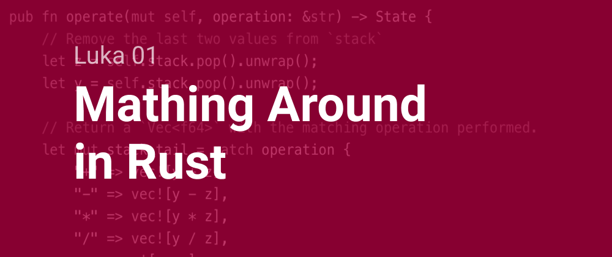

# Luka 01 - Mathing Around in Rust



> Read this post on [dev.to](https://dev.to/teckert/luka-01-mathing-around-in-rust-4pjb)

Date: 8 September 2019

## Branching Off

With the deployment pipeline set up from [Luka 00](./Luka00.md), any push to the `master` branch will kick off a new build/deploy instance and update the live website. That's great! But also I don't want to break it.

The solution here is to create a new `git` branch, in this case I'll call it `dev`. I can push code to this branch without setting off the pipeline. Taking this a step further, I will create a branch from `dev` called `add-rust-four-functions` and use that branch to create the first four functions for the calculator: +, -, *, /.

Then, when that work is done, I'll make a pull request to `dev`, then a pull request to `master`. I'll be reviewing my own code with each pull request, usually there is someone else who will approve the code review. Seems silly in certain ways and probably alien to some devs, but I like this model because it forces some level of reasonable caution around production.  

All work will follow this branching pattern:


> This is a good time to note that I steal a lot of the color pallets for quick images like the one above from [flatuicolors.com](https://flatuicolors.com/). They have done the hard work of finding which colors go together well.

## Rusty on Arithmetic

Now I can write some code! On the `add-rust-four-functions`, I created a library in Rust using `cargo new calculator --lib`. For now, I'm going to call this library `calculator` because it will do all the calculations for the project.

The model I'm thinking of using -- that I'm pretty sure will work is to have a `stack` object with methods that change the state of the `stack` and return its whole state. If I was writing the entire project in Rust, I wouldn't use this model, but I like the idea of just having this "functional" interface so the TypeScript only needs to directly query for the state of the `stack` once (when it's initialized).

If I find later on that this isn't the right model, I'll change it.  

The default `lib.rs` created by Cargo has a single test:

``` rust
#[cfg(test)]
mod tests {
    #[test]
    fn it_works() {
        assert_eq!(2 + 2, 4);
    }
}
```

I'll keep this testing module for now, but above it start creating the `stack`. While I'm writing I just have this document and `lib.rs` open in VS Code and I'm flipping back and forth. I feel some trepidation calling this just "stack". A stack is a known part of computer science and I might be suggesting features of the objects this `struct` generates that create a false impression.

With that in mind, I am actually going to call this `State` and have it contain an object called `stack`. The struct is

``` rust
/// # State
///
/// Contains every value on the reverse polish notation calculator stack.
pub struct State {
    /// State handling for the "stack" uses a Vec that is treated as a stack.
    pub stack: Vec<f64>,
}
```

One of the things I love about Rust is the ability to document the code in Markdown and generate documentation from that.

The first thing to implement is a `new` function. This is a common paradigm in Rust to have the first trait (think methods) be a function called `new` that returns an instance of the `struct`. Here, I am initializing the object with four zeroes in the stack. I'm not totally sure if this is what I will end up doing, but it's a start.

``` rust
impl State {
    /// Creates a new instance of `State` with a stack of 4 zeros.
    pub fn new() -> State {
        State {
            stack: vec![0.0, 0.0, 0.0, 0.0],
        }
    }
}
```

> Worth noting if you are unfamiliar with Rust is that a function will return the value on the last line if that line does not end in a semicolon. For example,
>
> ``` rust
> fn add(a: i32, b: i32) -> i32 {
>     return a + b;
> }
> ```
>
> is the same as
>
> ``` rust
> fn add(a: i32, b: i32) -> i32 {
>     a + b
> }
> ```

Now I'm going to replace the default test in `lib.rs` with a test called `it_initializes`:

``` rust
#[cfg(test)]
mod tests {
    use super::*;

    #[test]
    fn it_initializes() {
        let _ = State::new();
    }
}
```

✅ The test passes!

I feel kind of uncertain about this next part. I'm going to try a "functional-ish" approach where each instance of `State` has functions that consume the `State` and produce a new instance of `State` with the appropriate change made. This is done so that every trait returns a `State` object without having a bunch of mutable state running around. I honestly don't know if it's the right choice, but I am going to try it and see what happens.

The first example of this design can be seen with the `push` trait:

``` rust
impl State {

    ...

    /// Pushes `value` to `State.stack` then creates a new instance of `State`
    /// using the appended to `stack`
    pub fn push(mut self, value: f64) -> State {
        self.stack.push(value);
        State { stack: self.stack }
    }
}
```

I really wish I could append to the `stack` and create the new `State` in the same line. If `Vec<>.push()` returned the values in the `Vec<>` I could have written `State { stack: self.stack.push(value) }`, but the designers of Rust are smart. I would assume there is a good reason they didn't implement it that way.

A new trait calls for a new test:

``` rust
#[cfg(test)]
mod tests {
    use super::*;

    ...

    #[test]
    fn it_pushes() {
        // Given
        let expected_stack = vec![3.14159];
        let pushed_value = 3.14159;

        // When
        let state = State { stack: vec![] };
        let state_prime = state.push(pushed_value);

        // Then
        assert_eq!(expected_stack, state_prime.stack);
    }
}
```

✅ The test passes!

Here I am using the given, when, then model of testing which I really like. Martin Fowler explains it well [here](https://martinfowler.com/bliki/GivenWhenThen.html).

For the four functions +, -, *, /. I am going to have a single function called `operate`. It performs the operation passed to it on the last two values in the `stack`. I'm going to expect Wasm to pass a string from TypeScript to Rust and I'll have Rust interpret that into a operation with a match statement.  

If this project were all Rust, maybe I would have this trait take a function and use that, but I'll settle for this for now. If the trait is unable to match the string to a function, it will just return the state as it was before. Failing quietly like this is not my usual M.O., but I think it makes sense with this UI where crashing in some unexpected way might be worse. If the Rust can't make sense of what it's being asked to do, it'll just shrug and give back the last thing it knows about.  

``` rust
impl State {

    ...

    /// Perform the operation passed as string on the last two values in the `stack`.  
    /// Expects a string matching one of the following: `+`, `-`, `*`, `/`.
    /// If a string is passed that doesn't match, the function will return the `State` unchanged.
    ///
    /// ``` rust
    /// use calculator::State;
    /// let state = State{ stack: vec![6.0, 2.0] };
    /// let state_prime = state.operate("/");
    /// assert_eq!(vec![3.0], state_prime.stack);
    /// ```
    ///
    /// > The trait takes a `&str` in order to process operations from TypeScript, through Wasm, by passing operations as a TypeScript `string`.
    ///
    pub fn operate(mut self, operation: &str) -> State {
        // Remove the last two values from `stack`
        let z = self.stack.pop().unwrap();
        let y = self.stack.pop().unwrap();

        // Return a `Vec<f64>` with the matching operation performed.
        let mut stack_tail = match operation {
            "+" => vec![y + z],
            "-" => vec![y - z],
            "*" => vec![y * z],
            "/" => vec![y / z],
            _ => vec![y, z],
        };
        // Return a new instance of `State` with the `stack_tail` appended.
        self.stack.append(&mut stack_tail);
        State { stack: self.stack }
    }
}
```

There are five paths through this function. I'll need to write at least five tests. Match statements, like switch statements, create several branches that must be tested.

Writing the function in the given, when, then model saves me a lot of time here. For each function, I only need to change the values of `expected_stack` and `operation`.

``` rust
#[cfg(test)]
mod tests {
    use super::*;

    ...

    #[test]
    fn it_adds() {
        // Given
        let expected_stack = vec![6.0];
        let operation = "+";

        // When
        let state = State {
            stack: vec![2.0, 4.0],
        };
        let state_prime = state.operate(operation);

        // Then
        assert_eq!(expected_stack, state_prime.stack);
    }
}
```

## Wrap Up  

Now, with those functions added, I feel comfortable merging this branch back into `dev`, then back to `master`. It won't change anything apparent on the front end, but the new Rust code will be up there floating in blob storage.

Starting Commit: [70feecdd8f9a4c645e5847da8382dcd58947344e](https://github.com/t-eckert/luka/tree/70feecdd8f9a4c645e5847da8382dcd58947344e)  
Ending Commit: [f37109bf4b7b3d22ef0b54785f9104f453d3c8c4](https://github.com/t-eckert/luka/tree/f37109bf4b7b3d22ef0b54785f9104f453d3c8c4)
