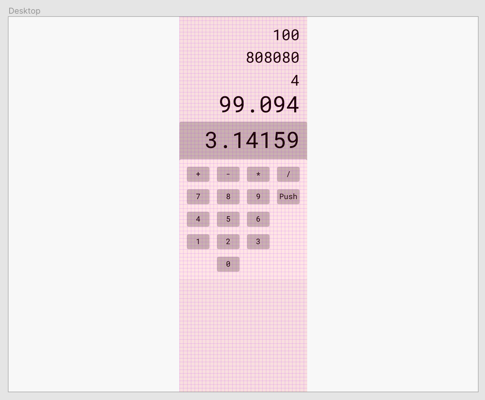

# Luka 02

Date: 9 September 2019

Let's add some buttons. For this iteration, I want to have a UI that can display the `state` I created in Luka 01, 10 number buttons, and a button for each arithmetic function.  

It doesn't need to start off too pretty, here is the layout I made in Figma on the bus while listening to The Killers:

I can group the buttons into three types: the number buttons (0 through 9) append to the right side of the string that is presented in the "display", the function buttons each call the `operate` function on the Rust side with the string of the button's label, and the push button which will call the `push` function on the Rust side. I'm going to eventually want each of these to be a different color which will help a user visually parse what they can do, but for now, they can all take the same CSS and I'll differentiate the colors by applying classes.

