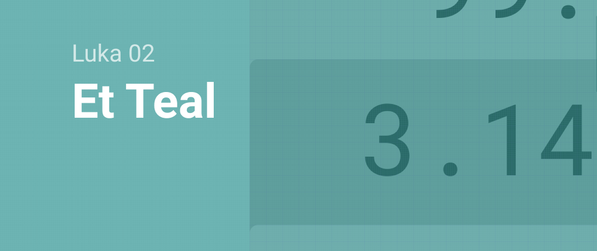
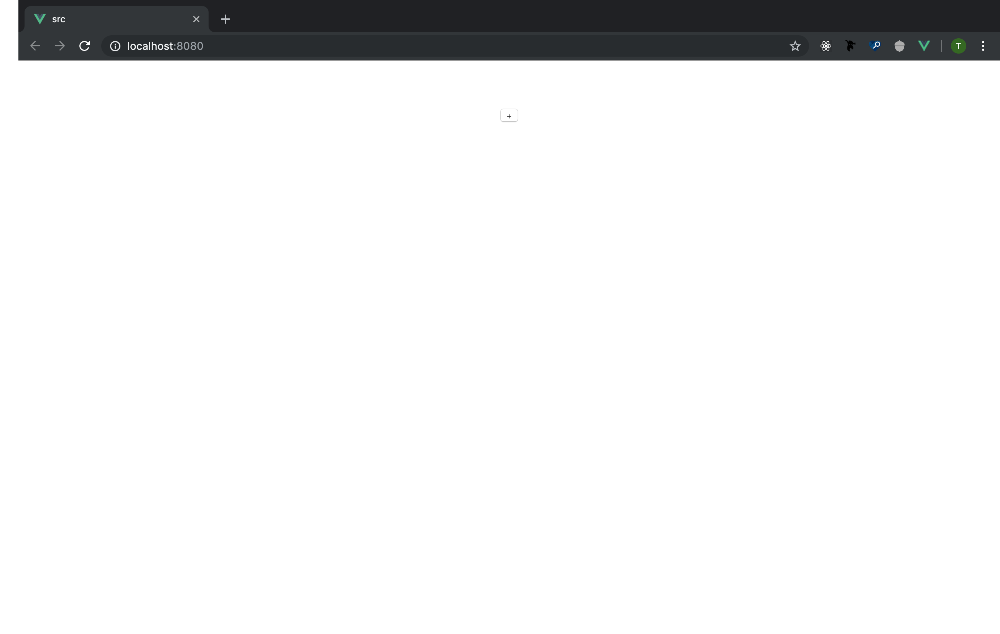

# Luka 02 - Et Teal



> Read this post on [dev.to](https://dev.to/teckert/luka-02-et-teal-4lm3)

Date: 9 September 2019

Let's add some buttons. For this iteration, I want to have a UI that can display the `state` I created in Luka 01, 10 number buttons, and a button for each arithmetic function.  

It doesn't need to start off too pretty, here is the layout I made in Figma on the bus while listening to The Killers:


I can group the buttons into three types: the number buttons (0 through 9) append to the right side of the string that is presented in the "display", the function buttons each call the `operate` function on the Rust side with the string of the button's label, and the push button which will call the `push` function on the Rust side. I'm going to eventually want each of these to be a different color which will help a user visually parse what they can do, but for now, they can all take the same CSS and I'll differentiate the colors by applying classes.

There is a lot of code I ripped out of the default Vue template -- more than would be worth noting here. I also added a reference to the `main.css` file that I am using to style the whole application.

The base `App.vue` implements a `CalculatorBase.vue` component which will hold all of the components that make up the calculator. I created a component called `ButtonOperation.vue` and put a button on it.

Voila! We're almost done!



I gave the button the following styling:

``` css
:root {
    --teal-dark: #319795;
    --teal-light: #38b2ac;
    --shadow: 0 4px 6px -1px rgba(0, 0, 0, .1), 0 2px 4px -1px rgba(0, 0, 0, .06);
}

html {
    font-size: 16px;
}

button {
    text-align: center;
    font-weight: 700;
    border-color: transparent;
    border-radius: 0.25rem;
    flex-shrink: 0;
    justify-content: center;
    cursor: pointer;
    color: #fff;
    background-color: var(--teal-light);
    padding: 0.5rem 1rem;
    margin: 1rem;
    box-shadow: var(--shadow);
    transition: background-color 80ms linear;
}

button:hover {
    background-color: var(--teal-dark);
}

button:active {
    background-color: var(--teal-light);
}
```

And now the button is teal. When hovered, it will turn a darker shade of teal over the course of 80ms. When clicked, it will immediately jump to the light teal again.


## Wrap Up

I wanted to do more today, but for now I have a teal button deployed. Go to [https://lukarpn.z14.web.core.windows.net](https://lukarpn.z14.web.core.windows.net) if you want to enjoy clicking on it.

Starting Commit: [f37109bf4b7b3d22ef0b54785f9104f453d3c8c4](https://github.com/t-eckert/luka/tree/f37109bf4b7b3d22ef0b54785f9104f453d3c8c4)

Ending Commit: [d712b197986e3279dc76c22baeb31fbeabad0b4c](https://github.com/t-eckert/luka/tree/d712b197986e3279dc76c22baeb31fbeabad0b4c)
