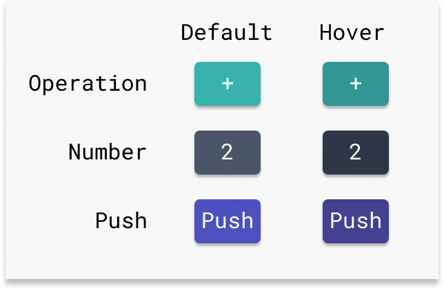
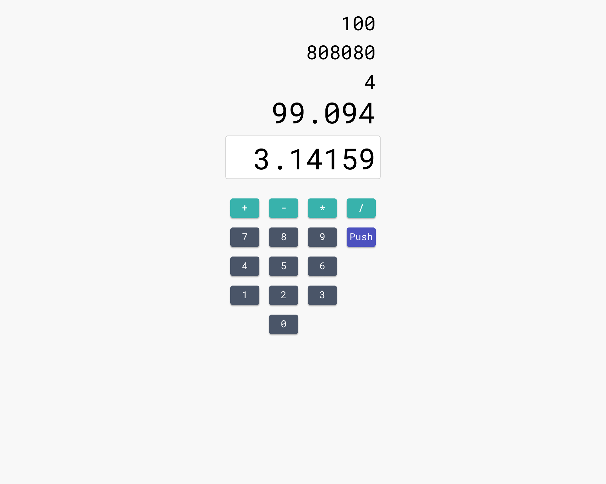
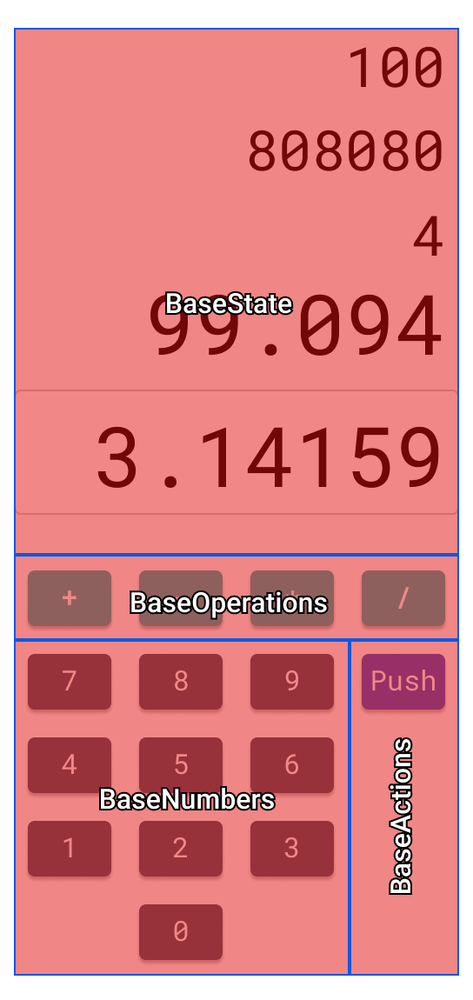

# Luka 03

Date: 10 September 2019

## Button++

One button is good, but does not a calculator make. It's time to add components for `ButtonPush` and `ButtonNumber`.

Before starting that, I am just going to change the page title in the base HTML to Luka. I want to make a cool favicon too, but that can wait until I have the design and color scheme nailed down.  

I moved the three button components into a directory called `buttons`.  

``` text
buttons
|- ButtonNumber.vue
|- ButtonOperation.vue
|- ButtonPush.vue
```

There are likely to be more of them and I want anyone coming to this project to be able to find any part of the code they need to change. The button components are all similar, that will change as I give them behavior.

Next, I want to arrange them using CSS Grid within the `CalculatorBase` component. I made some changes to the layout and added colors that I have stolen from [TailwindCSS](https://tailwindcss.com/):



The colors here are:

|           | Default |  Hover  |
| --------: | :-----: | :-----: |
| Operation | #38B2AC | #319795 |
|    Number | #4A5568 | #2D3748 |
|      Push | #4C51BF | #434190 |

I am going to set the color scheme for Number to be the default and add styling to make Operation and Push buttons distinct.

The additional styling is set on the component itself. This can be seen in the `ButtonPush` component here:

``` vue
<template>
  <button>Push</button>
</template>

<script lang="ts">
import { Component, Prop, Vue } from "vue-property-decorator";

@Component
export default class ButtonPush extends Vue {}
</script>

<style scoped>
:root {
  --button-default: #4c51bf;
  --button-hover: #434190;
}

button {
  background-color: var(--button-default);
}

button:hover {
  background-color: var(--button-hover);
}

button:active {
  background-color: var(--button-default);
}
</style>
```

The `ButtonOperation` component is similar.

## Separation of Concerns

I iterated on the design from Luka 02, adding the coloring and adjusting the layout a bit. This new design can be separated into several components. First we see the intent of the design without the separation highlighted:



The component separations can be seen here:



The next step is to build these `Base` components and populate them with buttons.
