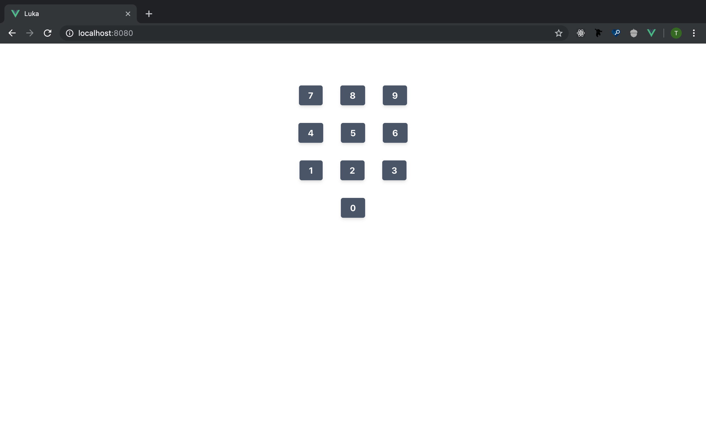
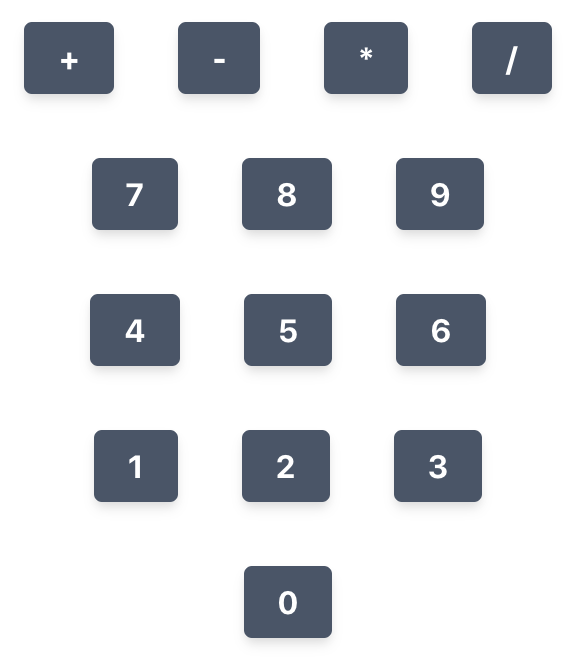
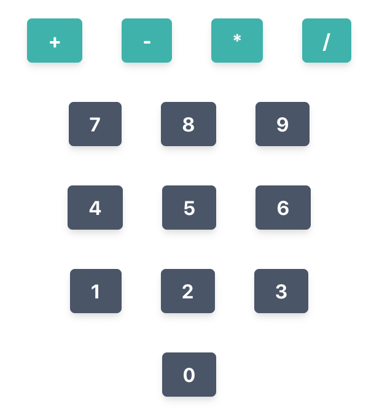
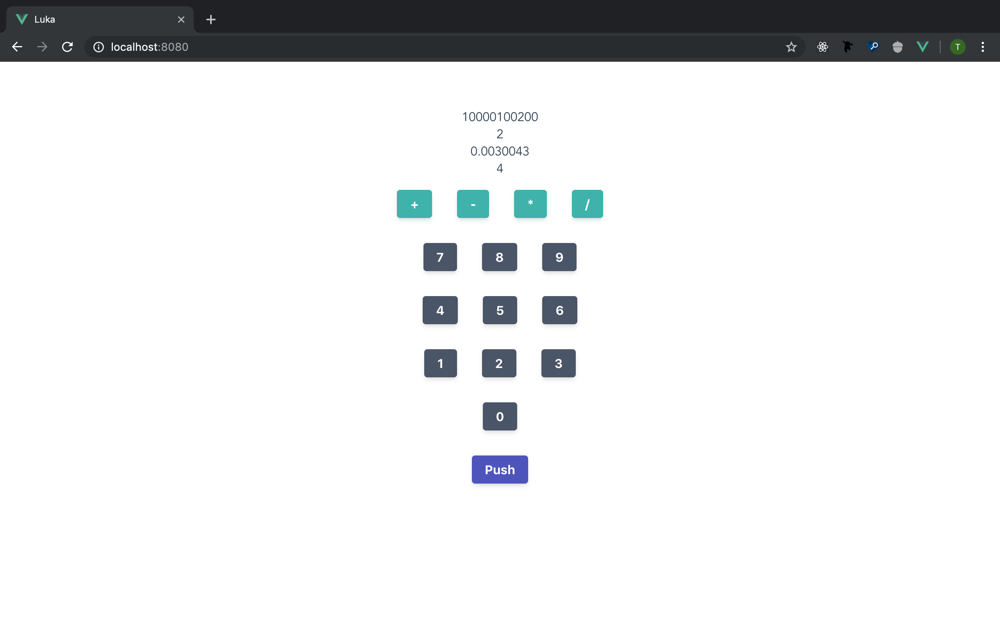

# Luka 03 - See. Assess.


> Read this post on [dev.to](https://dev.to/teckert/luka-03-see-assess-4p7d)

Date: 10 September 2019

## Button++

One button is good, but does not a calculator make. It's time to add components for `ButtonPush` and `ButtonNumber`.

Before starting that, I am just going to change the page title in the base HTML to Luka. I want to make a cool favicon too, but that can wait until I have the design and color scheme nailed down.  

I moved the three button components into a directory called `buttons`.  

``` text
buttons
|- ButtonNumber.vue
|- ButtonOperation.vue
|- ButtonPush.vue
```

There are likely to be more of them and I want anyone coming to this project to be able to find any part of the code they need to change. The button components are all similar, that will change as I give them behavior. I made some changes to the layout and added colors that I have stolen from [TailwindCSS](https://tailwindcss.com/):


The colors here are:

|           | Default |  Hover  |
| --------: | :-----: | :-----: |
| Operation | #38B2AC | #319795 |
|    Number | #4A5568 | #2D3748 |
|      Push | #4C51BF | #434190 |

I am going to set the color scheme for Number to be the default and add styling to make Operation and Push buttons distinct.

The additional styling is set on the component itself. This can be seen in the `ButtonPush` component here:

``` vue
<template>
  <button>Push</button>
</template>

<script lang="ts">
import { Component, Prop, Vue } from "vue-property-decorator";

@Component
export default class ButtonPush extends Vue {}
</script>

<style scoped>
:root {
  --button-default: #4c51bf;
  --button-hover: #434190;
}

button {
  background-color: var(--button-default);
}

button:hover {
  background-color: var(--button-hover);
}

button:active {
  background-color: var(--button-default);
}
</style>
```

The `ButtonOperation` component is similar.

## Separation of Concerns

I iterated on the design from Luka 02, adding the coloring and adjusting the layout a bit. This new design can be separated into several components. First we see the intent of the design without the separation highlighted:


The component separations can be seen here:


The next step is to build these `Base` components and populate them with buttons.

Now the component structure is

``` text
|-App.vue                   implements Calculator
|-components/
| |-Calculator.vue          implements BaseActions, BaseNumbers, BaseOperations, BaseState
| |-bases/
| | |-BaseActions.vue       implements ButtonPush
| | |-BaseNumbers.vue       implements ButtonNumber
| | |-BaseOperations.vue    implements ButtonOperation
| | |-BaseState.vue
| |-buttons/
| | |-ButtonNumber.vue
| | |-ButtonOperation.vue
| | |-ButtonPush.vue
```

I'm going to start with the `BaseNumbers` which is going to have a 3x4 grid.  

Ok, not a bad start:



There is definitely a slicker way to iterate through the numbers to draw them all to the screen, but what I have works for now.

## A Colorful CSS Mistake

Here is something worth investigating. I added `ButtonOperation` components to the `BaseOperations` component and that component to the `Calculator`. It drew the buttons in the app, but they still have the base button color!



This kind of investigating comes up in writing software all the time. Let's dig in.  

The problem could come about because I am defining the new colors in a `root:` on the component. One good way of finding the source of problems is shortening the path between two points in the system. Here, instead of defining the color as a variable, then setting it from that variable, I'll just directly set it.

That fixed it:



This CSS did not work:

``` css
:root {
  --button-default: #38b2ac;
  --button-hover: #319795;
}

button {
  background-color: var(--button-default);
}

button:hover {
  background-color: var(--button-hover);
}

button:active {
  background-color: var(--button-default);
}
```

This CSS did work:

``` css
button {
  background-color: #38b2ac;
}

button:hover {
  background-color: #319795;
}

button:active {
  background-color: #38b2ac;
}
```

The problem being that I was setting the `root:` within a scoped CSS Vue styling component. I might do more research on it later, but from an understanding of what it would mean to be scoped, it makes sense that I cannot put `root:` within something that is scoped, it would never reach the "top" of the CSS hierarchy. Maybe that's not the right way to say it. Hopefully my point comes across.

I have two ways I could still do this using a variable-type syntax. One is to use SCSS in the scoped CSS component and set the variables as SCSS variables. The other is to set all color variables in a `root:` in `main.css`.

I like the latter option because it gives future maintainers a single file to change the color of every button in the UI.  

The `main.css` now contains the definition for every button color. When I add more buttons/functionality, I'll put the colors here too:

``` css
:root {
    --button-default: #4A5568;
    --button-default-hover: #2D3748;
    --button-operation: #38b2ac;
    --button-operation-hover: #319795;
    --button-push: #4c51bf;
    --button-push-hover: #434190;
    --shadow: 0 4px 6px -1px rgba(0, 0, 0, .1), 0 2px 4px -1px rgba(0, 0, 0, .06);
}

button {
    text-align: center;
    font-weight: 700;
    border-color: transparent;
    border-radius: 0.25rem;
    flex-shrink: 0;
    justify-content: center;
    cursor: pointer;
    color: #fff;
    background-color: var(--button-default);
    padding: 0.5rem 1rem;
    margin: 1rem;
    box-shadow: var(--shadow);
    transition: background-color 80ms linear;
}

button:hover {
    background-color: var(--button-default-hover);
}

button:active {
    background-color: var(--button-default);
}
```

Then the components call to these variables from their styles, for instance, the `ButtonOperation` style is

``` css
button {
  background-color: var(--button-operation);
}

button:hover {
  background-color: var(--button-operation-hover);
}

button:active {
  background-color: var(--button-operation);
}
```

And that works! (I almost took another screenshot to show below, but it just looks the same as it does above -- which was what I was going for -- so success!)

## One Last Button and Some Fake State to go with it

Adding the `BaseActions` and `ButtonPush` components is much the same process. The buttons are not on the grid yet, I will fix that later.

The `BaseState` component is different from the other `Base*` components, because I am going to pass data to it. This might be a good time to talk about how I plan to structure the state handling in the `Calculator` component and how I'm thinking about component interaction as a whole.

Each `Button*` component will affect the state in some way. Rather than that component changing state directly or communicating to Wasm to do calculations, I'm going to route all state-changing operations through the `Calculator` component. Here is an example of how I want this to work:

1. The initial state stack is `[2.0, 4.0]`.
2. The `+` button is clicked.
3. The `ButtonOperation` component passes "+" to `BaseOperations`.
4. `BaseOperations` passes `operate("+")` to `Calculator`
5. `Calculator` parses the instruction and passes it to Wasm `calculator` which passes back the state `[6.0]`.
6. `Calculator` passes the state to `BaseState` which handles rendering it properly.

While the state doesn't have to be handled this way. I think it's just going to be safer to minimized the number of components that can directly change the state (in this case minimized to 1). When I talk about safer, I'm not talking about how the code is necessarily set up if the code were some static, unchanging document. If that were the case, either method would be "safe". But code changes, it is meant to change. Making those changes easier is part of what you learn as a software engineer.

I talked to a mentee recently about how growing as a software engineer is more about growth in wisdom rather than knowledge (though of course they are intertwined). Much of the hard knowledge of programming can easily be Googled. Modern compilers will guide you in the right direction too. Knowing what patterns to use and which to avoid is part of growing as an engineer.  

With that said, let's pass some fake state to the `BaseState` component. Setting an array of numbers called `state` in `Calculator` will cause `BaseState` to update with the last 4 values in that array. As things progress and I give more control to the user, I will need to be thoughtful about this mutable state. If someone were to continually push values onto the stack, they could eventually fill up the memory of the service worker rendering that tab in the browser.  

At least with Wasm and Vue, I don't have to worry about an insecure backend. If I were running the Rust portion of this code, holding the state, as a web server there could be potential for compromise by pushing unhandled values into the backend. If I didn't plan for that possibility, I could be in trouble -- more susceptible to DDOS attacks (You will always be susceptible to DDOS attacks. It's just a matter of making the attack hard enough to pull off.).

Here is the app as it now renders. I am going to merge back into master. I'm also going to delete the `add-function-buttons` branch that I've been working on. I no longer feel that is a good description of what I'm doing and I need a new name for this "feature".



## Wrap Up

I'm not sure what I want to do next. I'll have to sleep on it. Either I'll wire up the Wasm so I can get state from Rust or I'll work on passing the function of the buttons up the stack of Vue components.

Starting Commit: [7a7251ace3a5ed0b4c67f024130fdda5fb5580e7](https://github.com/t-eckert/luka/tree/7a7251ace3a5ed0b4c67f024130fdda5fb5580e7)

Ending Commit: [049a205f3a9e4c6cda6f9171a5b071d005b7152c](https://github.com/t-eckert/luka/tree/049a205f3a9e4c6cda6f9171a5b071d005b7152c)
